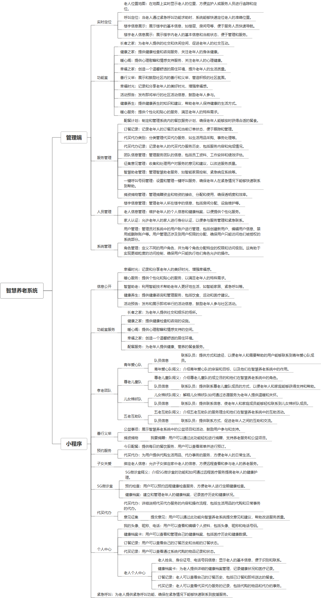

 

    
 

公司拥有上百套具有自主知识产权的软件系统，详情请查看码云首页或公司官网

 
<h1>智慧养老</h1>

<a href="https://www.haishi.net.cn/">公司官网</a> ｜ <a href="https://www.haishi.net.cn/">在线体验</a>

 

## 系统介绍

创建 “系统+服务+老人+终端”的智慧养老服务模式，对接机构、街道办、社区等多平台，实现涵盖了机构养老、居家养老、社区日间照料等多种养老形式。支持接入电子血压仪、血糖仪、呼叫器等智能设备，实现老人身体健康监测。
创建 “系统+服务+老人+终端”的智慧养老服务模式，对接机构、街道办、社区等多平台，实现涵盖了机构养老、居家养老、社区日间照料等多种养老形式。支持接入电子血压仪、血糖仪、呼叫器等智能设备，实现老人身体健康监测。
本项目名称为智慧养老系统，旨在通过科技手段提升老年人的生活质量和安全保障。该系统涵盖小程序端和管理端，为老年人、家属和养老机构提供便捷的沟通和管理工具。
小程序端主要功能包括设备绑定、个人中心、子女关爱、预约服务和健康状态查看等，方便老年人进行日常生活管理和与子女互动。
管理端为养老机构工作人员提供全面的管理功能，包括系统管理、人员管理、服务管理、实时定位、功能室管理等，实现对老年人生活、健康、安全等方面的全面照护。系统支持实时定位、一键呼叫等紧急救助功能，保障老年人的人身安全。
                

## 系统功能介绍

### 系统包含终端说明

管理端（WEB）、用户端（微信小程序）

| 序号 | 模块                  | 模块说明 |
| ---- | --------------------- | -------- |
| 1    | ZF-ZHYL-SQZHYL-UNIAPP | 未知类型 |
| 2    | ZF-ZHYL-SQZHYL-SERVER | 服务端   |
| 3    | ZF-ZHYL-SQZHYL-MANAGE | 管理端   |

### 系统功能结构

### 系统功能说明

**小程序端主要功能：**
- 设备绑定：将智能设备与系统绑定，实现数据采集和远程监控。
- 个人中心：老年人个人信息管理，包括健康数据、紧急联系人等。
- 子女关爱：方便子女与老年人沟通交流，了解老年人生活状态。
- 预约服务：老年人可以预约各种养老服务，如配餐、代买代办等。
- 健康状态：查看老年人的健康数据，及时了解健康状况。
**管理端主要功能：**
- 实时定位：实时查看老年人位置信息，保障安全。
- 呼叫定位：老年人一键呼叫后，系统可以快速定位并提供帮助。
- 服务管理：管理各种养老服务，包括配餐计划、代买代办等。
- 人员管理：管理老年人、家属和工作人员信息。
- 系统管理：系统配置和用户权限管理。
**核心功能：**
- 实时定位和呼叫定位：保障老年人安全，是系统的核心功能。
- 服务管理：提供多样化的养老服务，提升老年人生活质量。
- 家人认证：确保只有经过认证的家人才能访问老年人信息，保护隐私安全。

## 系统主要界面

## 系统技术说明

### 代码模块说明

| 序号 | 目录                              | 目录说明 |
| ---- | --------------------------------- | -------- |
| 1    | ZF-ZHYL-SQZHYL-SERVER/px-zhyl-biz | --       |

### 系统技术选型

#### 开发语言/框架

JAVA（JDK1.8）
前端框架：VUE2
前端框架：uni-app
框架：SpringBoot2.x

#### 服务中间件

Nginx
Tomcat

#### 数据库

MySQL（5.7+）
Redis

#### 其他说明

无

## 系统演示/商用

请扫码添加客服微信获取演示地址和系统详细资料。

如果您想基于智慧养老进行商业化交付或定制开发服务，我们提供有偿的技术服务支持，合作模式不限，欢迎沟通！

公司官网地址： <a href="https://www.haishi.net.cn/">https://www.haishi.net.cn</a>

联系客服获取专业回答。

## 使用须知

1、 本项目商用必须获得版权所有者的授权。

2、 未经允许本项目代码不允许二次出售。

